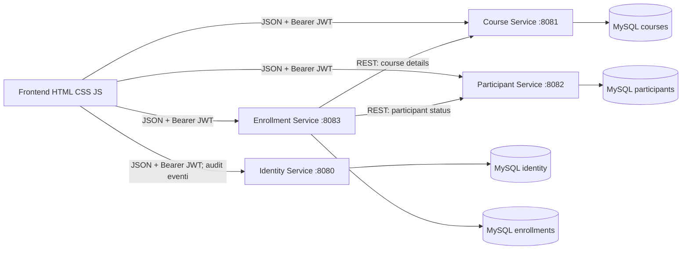

# Architettura

## Vista dei componenti

## Responsabilita'

- **Identity Service**: credenziali BCrypt, utenti, ruoli, login, firma/verifica dei JWT e registro audit persistente.
- **Course Service**: anagrafica dei corsi, validazione, ricerca, stato e assegnazione docente.
- **Participant Service**: anagrafica, ricerca per cognome/codice fiscale/e-mail, unicita' e disattivazione logica.
- **Enrollment Service**: ciclo di vita delle iscrizioni, calendario delle lezioni, controllo di capienza e duplicati, presenze e frequenza.
- **Frontend**: schermate di accesso, operazioni, dashboard con grafici e filtri, audit ed esportazioni; conserva il token nel local storage e lo invia come Bearer.

Ogni servizio e' organizzato in controller, service, repository, entity, DTO, mapper, eccezioni e configurazione. Ogni database e' separato logicamente. Enrollment conserva gli identificativi dei servizi proprietari e li verifica tramite client REST; non condivide le loro entity.

Il registro `audit_events` risiede nel database Identity. Dopo una mutazione riuscita dalla UI, il browser invia azione, risorsa e ID; Identity ricava l'attore dal JWT e assegna il timestamp lato server. Non vengono conservati payload o dati personali. Il registro copre le modifiche inviate dalla UI, non le scritture dirette alle API effettuate da client esterni.

La ricerca avanzata combina filtri sul frontend con le API esistenti; l'audit usa query server-side paginata per attore/ID, risorsa, azione e intervallo di date. Le esportazioni sono riservate all'amministratore: il browser raccoglie i dataset autorizzati e genera PDF, XLSX, CSV o JSON; CSV multipli vengono raccolti in ZIP. PDF, XLSX e ZIP richiedono librerie caricate da CDN. Il registro audit e' operativo, non anti-manomissione, perche' l'evento viene notificato dal client.

## Sicurezza e configurazione

Le API applicative richiedono un JWT, salvo login e documentazione OpenAPI. Le autorizzazioni distinguono amministratore, tutor e docente. Tutti i servizi validano lo stesso issuer e la stessa chiave HMAC Base64 da variabile d'ambiente. Password e segreti di sviluppo nel file `.env` non devono essere versionati. CORS consente le origini locali `localhost:5500` e `localhost:8088`.

## Avvio

Docker Compose avvia MySQL 8.4, i quattro servizi e Nginx per il frontend. Il database attende un healthcheck MySQL; le applicazioni attendono il database. Hibernate aggiorna lo schema all'avvio. Per una release produttiva servono migrazioni versionate, credenziali MySQL con privilegi minimi, segreti sicuri, TLS e healthcheck applicativi.