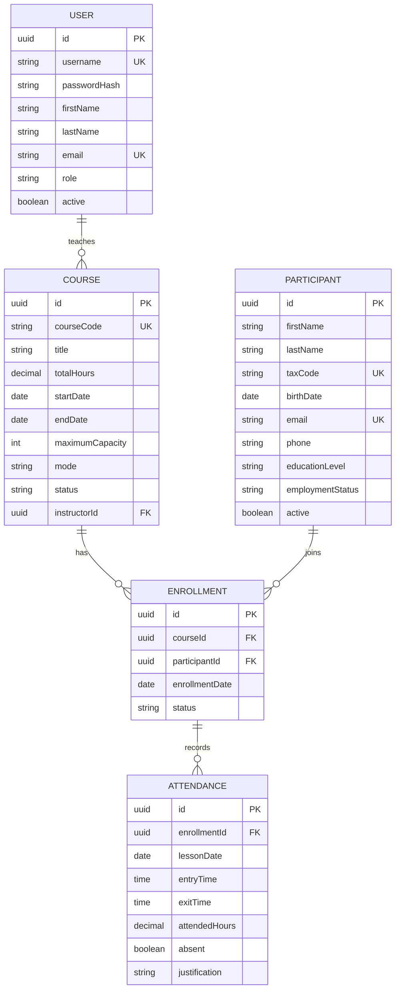

# Modello dati

Ogni microservizio persiste le proprie entita' nel rispettivo database. Le relazioni tra domini distinti sono rappresentate con UUID e controllate tramite API REST.

`FK` indica un riferimento logico tra microservizi, non una foreign key MySQL cross-database. Course code, codice fiscale ed e-mail sono univoci. Una sola iscrizione tra `REQUESTED` e `CONFIRMED` e' ammessa per coppia partecipante-corso; le iscrizioni in tali stati occupano capienza. Le ore corso sono positive, le ore presenza non negative, e una lezione deve ricadere nel periodo del corso.

Il file `database/init/01-create-databases.sql` crea i database vuoti. Le tabelle sono create/aggiornate da Hibernate (`ddl-auto=update`); non sono ancora presenti migrazioni versionate.